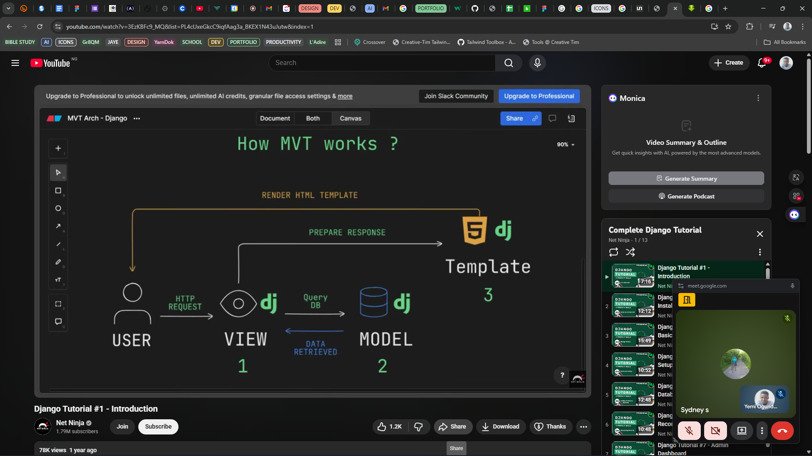

# django_practice

Django practice

## my first attempt at django

Model View Template (MVT)
Model = data structure
View = http requests and responses and interaction
Template = html files that contains structures

 - how django MVT works

## installing django

### create a virtual environment (pip install pipenv)

#### activate the VE (pipenv shell)

#### pipenv install django

#### confirm django is installed (pip freeze)

#### start django project (django-admin startpoject project_name)

#### cd into project_name startapp (py manage.py startapp app_name)

#### run your server (py manage.py runserver)

**********************
#### create a shell with (py manage.py shell)
##### you can add data to your db using the object_name.save() )

#### create  superuser after setting up model in admin.py with = py manage.py createsuperuser

### Statics file
#### css, js, images etc
#### static files store STATICFILES_DIR or STATIC_URL = 'static/' in settings.py